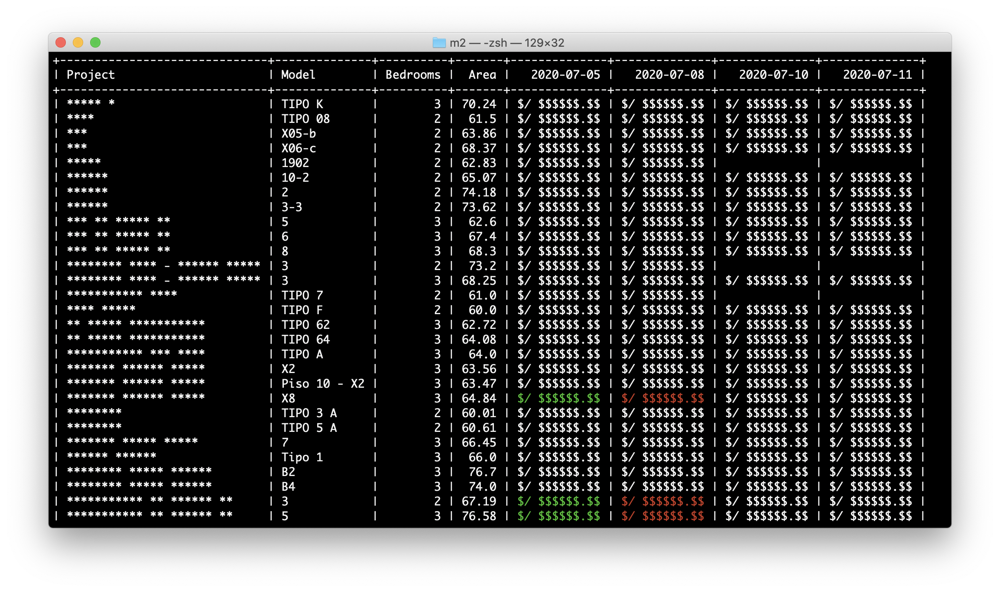

# M2

Extrae información de portales inmobiliarios usando web scraping.



> **Nota:** Solo para uso personal.

## Instalación

Ejecuta los siguientes comandos en una terminal:

```
bundle install
chmod a+x cli.rb
```

## Uso

### Extraer datos:

Para extraer datos, primero se debe crear un archivo `projects.yml` que tenga la siguiente estructura:

```yaml
- https://nexoinmobiliario.pe/proyecto/venta-de-departamento-1234-magdalena-del-mar: TIPO A
- https://nexoinmobiliario.pe/proyecto/venta-de-departamento-5678-pueblo-libre: TIPO B
- https://nexoinmobiliario.pe/proyecto/venta-de-departamento-90ab-jesus-maria: TIPO C
```

> **Nota:** El código está pensado para usarse con Nexo Inmobiliario, pero puede ser modificado para usarse con otros portales.

Luego, ejecuta los siguientes comandos en una terminal, para guardar la información en un archivo `~/departamentos.csv`:

```bash
touch ~/departamentos.csv
./cli.rb list --format=csv >> ~/departamentos.csv
```

### Analizar datos:

Ejecuta el comando:

```bash
./cli.rb analyze
```

### Mirar histórico de datos:

Ejecuta el comando:

```bash
./cli.rb timeline
```

## Licencia

Este repositorio está disponible como código abierto bajo los términos de la [Licencia MIT](https://opensource.org/licenses/MIT).